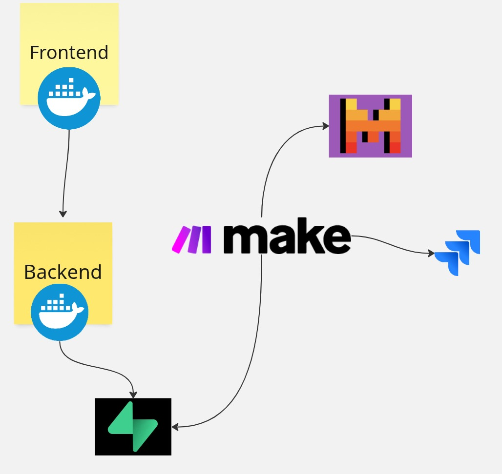
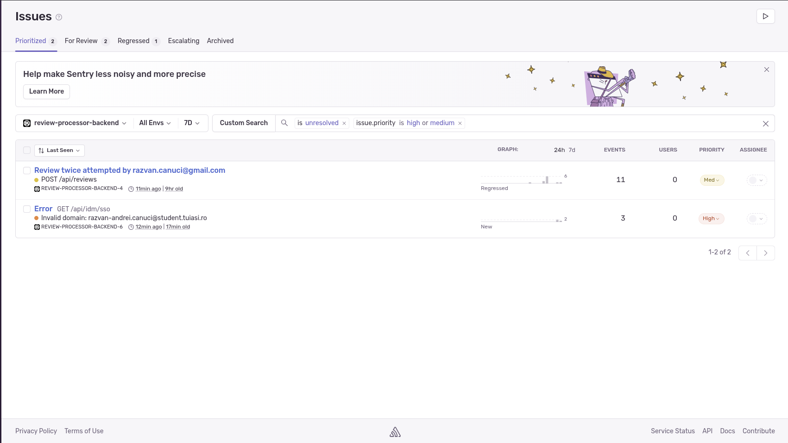

**Review Processor Project**

    
    
        
    
    
    
    
    
    
    

 
 
A web application that allows users (depends on the domain specified in backend's env vars) to submit reviews and suggestions. Suggestions are stored in a database and automatically processed using Mistral LLM and converted into Jira epics from Make.com.

🛠️ Technologies Used

Frontend: Vue.js, Quasar, TinyMCE

Backend: Rust

Database: PostgreSQL on Supabase

AI: Mistral (LLM) for task generation

Automation: Make.com

Project Management: Jira

Deployment: Docker on Render

Monitoring: Sentry.io

📝 How It Works

1. Users submit a review and suggestions.

2. If the review contains a suggestion, that suggestion is stored in a postgresql database.

3. If the review contains a suggestion, a Make.com automated scheduler triggers a pipeline.

4. The pipeline asks Mistral to create a title and a description for an epic.

5. The epic is created in Jira using the Jira API.

📺 Demo

Below there is the youtube video with the demo:

Also the link from the app present on the demo (works only with @gmail.com domain):

https://review-processor-frontend.onrender.com/

**The host enters in sleep mode if it is not used, it should be accessed more times before it starts working. Also there is some posibility to not work anymore**

🎨 Design 

📊 Monitoring

For the errors there are logs on Sentry.io:

